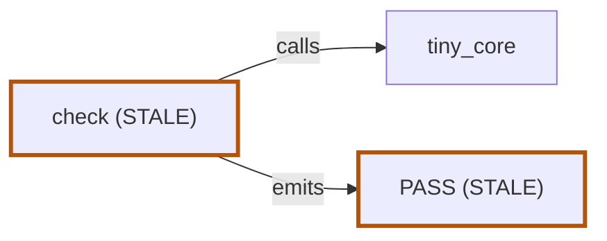

# `tiny` — map

- **Summary:** `A two-file fixture subject: one shell script and its SKILL.md, carrying four planted drift cases.`
- **Slug:** `tiny`
- **Kind:** `skill`
- **Root:** `plugin/skills/the-cartographer/references/fixtures/tiny`
- **Schema version:** `1`
- **Extractor version:** `1.0.0`
- **Generated:** `fixed stamp for the golden fixture (the real one is a wall-clock instant)`

This report is self-sufficient. Every node, edge, claim, evidence citation, coverage decision and drift finding the map carries is stated below in full, so it can be read and reconstructed without rendering any diagram.

## Drift

4 findings, in the drift engine's reporting order: a confirmed defect before an uncheckable claim. Each carries the attention bucket the page groups by — likely contract, ambiguous (needs review), or implementation detail. That is presentation only: detection is universal, and every finding is listed here in full whatever its bucket.

- **`PHANTOM`** — `mode.build` (`build`) · attention: `likely-contract`
  - `Documented at plugin/skills/the-cartographer/references/fixtures/tiny/SKILL.md:7, but the map carries no code evidence that it exists.`
  - Citations:
    - `plugin/skills/the-cartographer/references/fixtures/tiny/SKILL.md`:7
      - claimKind: `doc`
      - checked: **yes**
      - text: ``- `build` — compiles the project before running.``
- **`UNDOCUMENTED`** — `env.tiny_debug` (`TINY_DEBUG`) · attention: `likely-contract`
  - `Evidenced at plugin/skills/the-cartographer/references/fixtures/tiny/run.sh:7, but no claimKind:"doc" claim documents it — a code-comment claim is not documentation (ADR C-014).`
  - Citations:
    - `plugin/skills/the-cartographer/references/fixtures/tiny/run.sh`:7
      - note: `[ "${TINY_DEBUG:-0}" = "1" ] && printf ... >&2`
- **`STALE`** — `mode.check` (`check`) · attention: `likely-contract`
  - `The doc says check prints "check ran"; the code prints "core ran for check".`
  - Citations:
    - `plugin/skills/the-cartographer/references/fixtures/tiny/SKILL.md`:8
      - text: ``- `check` — runs the core routine and prints `check ran`.``
    - `plugin/skills/the-cartographer/references/fixtures/tiny/run.sh`:8
      - note: `printf 'core ran for %s\\n' "$1"`
- **`STALE`** — `outcome.pass` (`PASS`) · attention: `likely-contract`
  - `The comment says PASS goes to stdout; the code redirects it to stderr.`
  - Citations:
    - `plugin/skills/the-cartographer/references/fixtures/tiny/run.sh`:16
      - text: `# emits PASS on stdout`
    - `plugin/skills/the-cartographer/references/fixtures/tiny/run.sh`:18
      - note: `printf 'PASS\\n' >&2`

## Nodes

6 nodes.

- **`component.dispatch_table`** — `dispatch table`
  - kind: `component` · lane: `core` · inferred: **yes**
  - Summary: `Inferred: the case statement read as a mode dispatch table. Not directly citable, so inferred.`
  - Attributes: (none declared)
  - Drift: (none)
  - Evidence (0): (none)
  - Claims (1):
    - `plugin/skills/the-cartographer/references/fixtures/tiny/SKILL.md`:18
      - claimKind: `doc`
      - checked: **no** — the extractor could not check this claim, so it is reported as uncheckable rather than as a defect
      - text: `A dispatch table maps each mode to its function.`
  - Contradictions (0): (none)
- **`component.tiny_core`** — `tiny_core`
  - kind: `component` · lane: `core` · inferred: **no**
  - Summary: `The shared routine every mode calls. Documented and implemented in agreement.`
  - Attributes: (none declared)
  - Drift: (none)
  - Evidence (1):
    - `plugin/skills/the-cartographer/references/fixtures/tiny/run.sh`:6
      - note: `tiny_core() {`
  - Claims (1):
    - `plugin/skills/the-cartographer/references/fixtures/tiny/SKILL.md`:16
      - claimKind: `doc`
      - checked: **yes**
      - text: `` `tiny_core` is the shared routine every mode calls. ``
  - Contradictions (0): (none)
- **`env.tiny_debug`** — `TINY_DEBUG`
  - kind: `env` · lane: `external` · inferred: **no**
  - Summary: `Verbosity switch read by the core routine. Asserted only in a code comment.`
  - Attributes: (none declared)
  - Drift: `UNDOCUMENTED`
  - Evidence (1):
    - `plugin/skills/the-cartographer/references/fixtures/tiny/run.sh`:7
      - note: `[ "${TINY_DEBUG:-0}" = "1" ] && printf ... >&2`
  - Claims (1):
    - `plugin/skills/the-cartographer/references/fixtures/tiny/run.sh`:5
      - claimKind: `code-comment`
      - checked: **yes**
      - text: `# TINY_DEBUG=1 prints each mode as it starts.`
  - Contradictions (0): (none)
- **`mode.build`** — `build`
  - kind: `mode` · lane: `entry` · inferred: **no**
  - Summary: `Documented build mode. The script has no such mode.`
  - Attributes: (none declared)
  - Drift: `PHANTOM`
  - Evidence (0): (none)
  - Claims (1):
    - `plugin/skills/the-cartographer/references/fixtures/tiny/SKILL.md`:7
      - claimKind: `doc`
      - checked: **yes**
      - text: ``- `build` — compiles the project before running.``
  - Contradictions (0): (none)
- **`mode.check`** — `check`
  - kind: `mode` · lane: `entry` · inferred: **no**
  - Summary: `The only real mode: calls the shared core routine, then emits the outcome.`
  - Attributes: (none declared)
  - Drift: `STALE`
  - Evidence (2):
    - `plugin/skills/the-cartographer/references/fixtures/tiny/run.sh`:8
      - note: `printf 'core ran for %s\\n' "$1"`
    - `plugin/skills/the-cartographer/references/fixtures/tiny/run.sh`:11
      - note: `mode_check() {`
  - Claims (1):
    - `plugin/skills/the-cartographer/references/fixtures/tiny/SKILL.md`:8
      - claimKind: `doc`
      - checked: **yes**
      - text: ``- `check` — runs the core routine and prints `check ran`.``
  - Contradictions (1):
    - `The doc says check prints "check ran"; the code prints "core ran for check".`
      - claimed at `plugin/skills/the-cartographer/references/fixtures/tiny/SKILL.md`:8
        - text: ``- `check` — runs the core routine and prints `check ran`.``
      - observed at `plugin/skills/the-cartographer/references/fixtures/tiny/run.sh`:8
        - note: `printf 'core ran for %s\\n' "$1"`
- **`outcome.pass`** — `PASS`
  - kind: `outcome` · lane: `output` · inferred: **no**
  - Summary: `Success outcome emitted by the check mode.`
  - Attributes: (none declared)
  - Drift: `STALE`
  - Evidence (1):
    - `plugin/skills/the-cartographer/references/fixtures/tiny/run.sh`:18
      - note: `printf 'PASS\\n' >&2`
  - Claims (2):
    - `plugin/skills/the-cartographer/references/fixtures/tiny/SKILL.md`:12
      - claimKind: `doc`
      - checked: **yes**
      - text: `` `PASS` is emitted when the core routine succeeds. ``
    - `plugin/skills/the-cartographer/references/fixtures/tiny/run.sh`:16
      - claimKind: `code-comment`
      - checked: **yes**
      - text: `# emits PASS on stdout`
  - Contradictions (1):
    - `The comment says PASS goes to stdout; the code redirects it to stderr.`
      - claimed at `plugin/skills/the-cartographer/references/fixtures/tiny/run.sh`:16
        - text: `# emits PASS on stdout`
      - observed at `plugin/skills/the-cartographer/references/fixtures/tiny/run.sh`:18
        - note: `printf 'PASS\\n' >&2`

## Edges

4 edges.

- **`e.control.mode.check>component.tiny_core`**: `mode.check` → `component.tiny_core`
  - label: `calls` · kind: `control`
  - Evidence (1):
    - `plugin/skills/the-cartographer/references/fixtures/tiny/run.sh`:12
      - note: `tiny_core check`
- **`e.control.mode.check>outcome.pass`**: `mode.check` → `outcome.pass`
  - label: `emits` · kind: `control`
  - Evidence (1):
    - `plugin/skills/the-cartographer/references/fixtures/tiny/run.sh`:13
      - note: `emit_pass`
- **`e.data.component.tiny_core>env.tiny_debug`**: `component.tiny_core` → `env.tiny_debug`
  - label: `reads` · kind: `data`
  - Evidence (1):
    - `plugin/skills/the-cartographer/references/fixtures/tiny/run.sh`:7
      - note: `"${TINY_DEBUG:-0}"`
- **`e.data.mode.check>component.tiny_core`**: `mode.check` → `component.tiny_core`
  - label: `passes mode name` · kind: `data`
  - Evidence (1):
    - `plugin/skills/the-cartographer/references/fixtures/tiny/run.sh`:12
      - note: `tiny_core check`

## Views

### `tiny — overview`

- id: `overview` · form: `svg-hero`
- nodes (6): `component.dispatch_table`, `component.tiny_core`, `env.tiny_debug`, `mode.build`, `mode.check`, `outcome.pass`
- edges (4): `e.control.mode.check>component.tiny_core`, `e.control.mode.check>outcome.pass`, `e.data.component.tiny_core>env.tiny_debug`, `e.data.mode.check>component.tiny_core`
- Rendered as an inline SVG diagram in `map.html`. Its nodes and edges are listed above in full, so this report needs no picture to be complete.

### `tiny — control flow`

- id: `control-flow` · form: `mermaid` · mermaidType: `flowchart`
- nodes (3): `component.tiny_core`, `mode.check`, `outcome.pass`
- edges (2): `e.control.mode.check>component.tiny_core`, `e.control.mode.check>outcome.pass`

### `tiny — capabilities`

- id: `capabilities` · form: `table`
- nodes (3): `env.tiny_debug`, `mode.build`, `mode.check`

| `Capability` | `Kind` | `Evidence` | `Documented` |
| --- | --- | --- | --- |
| `TINY_DEBUG` | `env` | `plugin/skills/the-cartographer/references/fixtures/tiny/run.sh`:7 | no |
| `build` | `mode` | (none) | yes (1 doc claim) |
| `check` | `mode` | `plugin/skills/the-cartographer/references/fixtures/tiny/run.sh`:8; `plugin/skills/the-cartographer/references/fixtures/tiny/run.sh`:11 | yes (1 doc claim) |

## Coverage

- Fully read: 2 files.
  - `plugin/skills/the-cartographer/references/fixtures/tiny/SKILL.md`
  - `plugin/skills/the-cartographer/references/fixtures/tiny/run.sh`
- Partially read: none.
- Skipped: none.

Every declared source was read in full — no file was partially read or skipped.

## Sources

2 source files, each with the sha256 digest and line count recorded at extraction time. A snapshot whose digests no longer match the files on disk is stale by construction and must be regenerated, never patched.

| Path | Role | Lines | sha256 |
| --- | --- | --- | --- |
| `plugin/skills/the-cartographer/references/fixtures/tiny/SKILL.md` | `doc` | `18` | `d5286c885592c751e46e8024d10afd7ebc4ce85869c9cec7ed25a0ccdeff0f5c` |
| `plugin/skills/the-cartographer/references/fixtures/tiny/run.sh` | `code` | `24` | `c4c35315844d54093c993a78d5c296da5e3a8ce7a4b8cd5a8fb007ffb8315096` |

